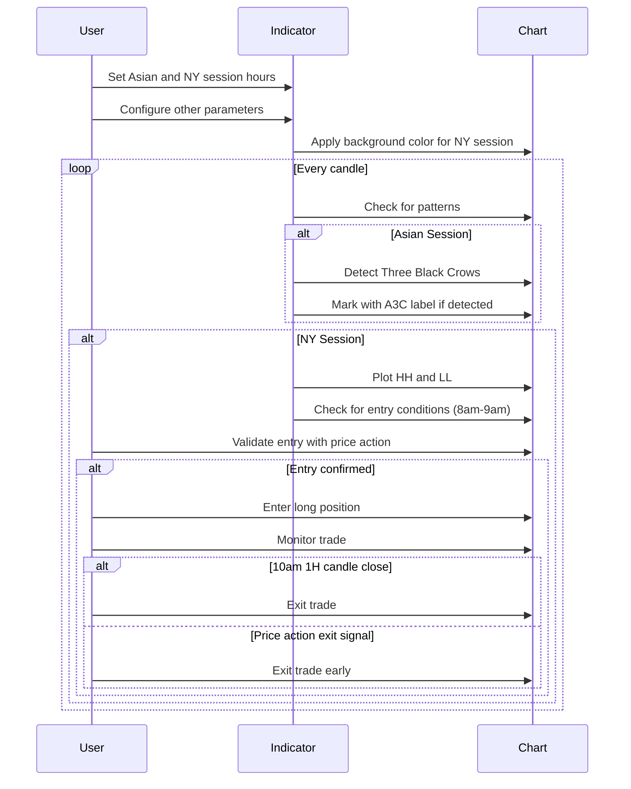

Certainly! I'll provide a detailed description of the script, installation instructions, usage guide, steps checklist, and a sequence diagram of the steps.

### Detailed Description of the Script

This PineScript indicator, named "Advanced Pattern Detector Pro [Yosiet]", is a sophisticated tool designed for TradingView charts. It combines multiple technical analysis techniques to identify complex trading patterns across different market sessions, with a particular focus on the Asian and New York trading hours.

Key features of the script include:

1. Detection of multiple candlestick patterns:
   - Three Stars in the South
   - Bullish Engulfing
   - Three Black Crows

2. Session-based analysis:
   - Asian session pattern detection
   - New York session highlighting and price range marking

3. Volume and accumulation analysis:
   - Volume threshold checks
   - Price range accumulation detection

4. Dynamic pattern strength calculation:
   - Based on volume and trend indicators

5. Visual aids:
   - Background coloring for New York session
   - Pattern labels with strength-based color intensity
   - Highest High (HH) and Lowest Low (LL) plotting for New York session

6. Strategy information display:
   - Table with step-by-step trading strategy

7. Customizable alert conditions for detected patterns

### Installation Instructions

1. Open TradingView and go to the chart you want to add the indicator to.
2. Click on the "Pine Editor" button at the bottom of the screen.
3. In the Pine Editor, delete any existing code.
4. Copy the entire script provided earlier and paste it into the Pine Editor.
5. Click the "Save" button in the Pine Editor.
6. Click the "Add to Chart" button to apply the indicator to your chart.

### How to Use the Indicator

1. After adding the indicator to your chart, you'll see a settings panel.
2. Adjust the input parameters as needed:
   - Asia Session Start and End Hours
   - Accumulation Period
   - Volume Threshold
   - Candle Body Threshold
   - NY Session Start and End Hours
   - Background color for NY session

3. Observe the chart for:
   - Colored background during NY session hours
   - Pattern labels (3S+E, 3C+A, A3C) appearing above or below candles
   - HH and LL markers during NY session

4. Check the top-right corner of the chart for the strategy steps table.

5. Set up alerts based on the detected patterns if desired.

### Steps Checklist

1. [ ] Confirm Asian session hours are correctly set
2. [ ] Verify NY session hours are properly configured
3. [ ] Check for "Three Black Crows" pattern during Asian session (A3C label)
4. [ ] Identify the Lowest Low (LL) between Asian and London sessions
5. [ ] Monitor for potential long entry between 8am and 9am NY time
6. [ ] Validate entry using price action patterns
7. [ ] Manage trade until 10am 1H candle close
8. [ ] Exit trade at 10am 1H candle close or based on price action

### Sequence Diagram of Steps

This sequence diagram illustrates the flow of actions and decisions in using the indicator. It starts with the user configuring the indicator, followed by the continuous process of pattern detection and decision-making during different trading sessions. The key steps of identifying patterns in the Asian session, finding entry points in the NY session, and managing trades are represented in the diagram.

For more, can contact me on https://www.tradingview.com/u/yosietserga/
